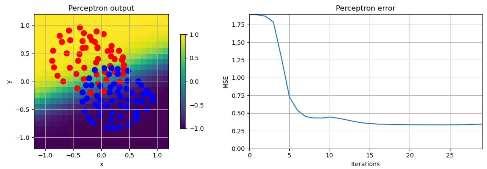
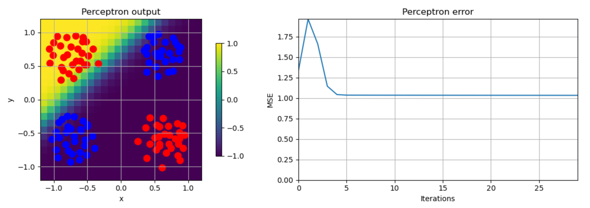
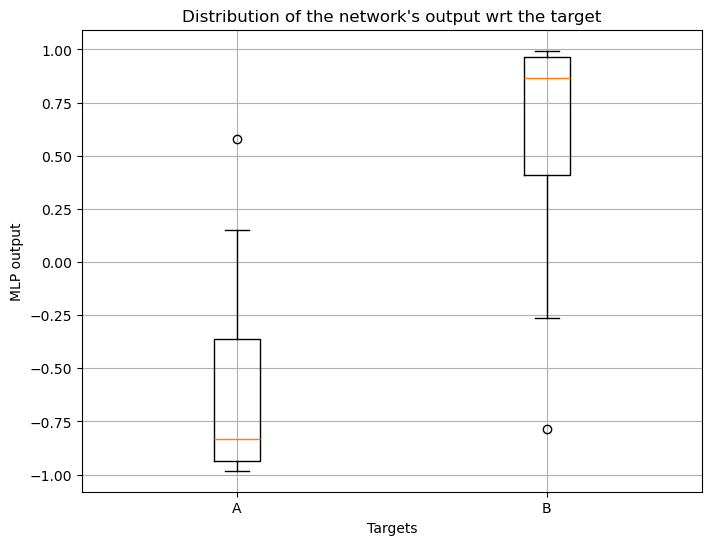
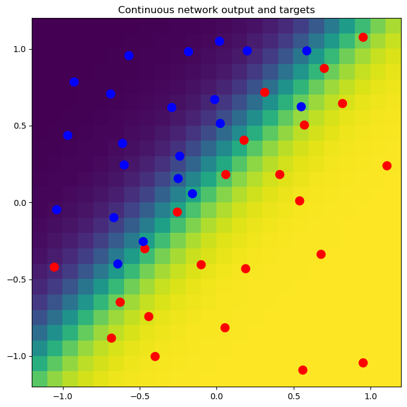
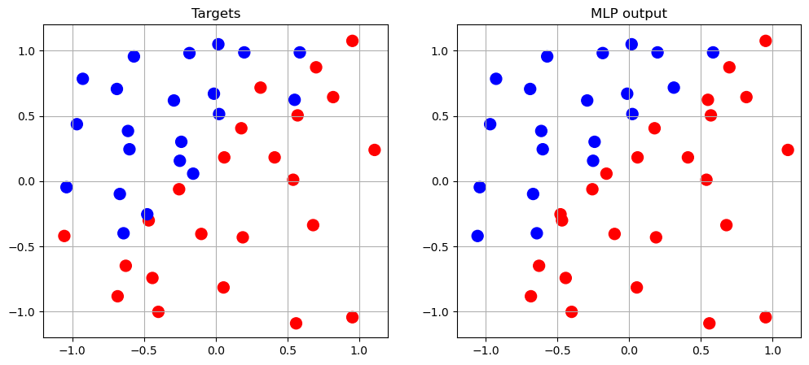

# MachLe PW 10 - Report

#### authors: Rafael Dousse, Massimo Stefani, Eva Ray

## 1. The Perceptron and the Delta rule

### 1_activation_function

> 1. Observe the shape of the different activation functions proposed.

Here are the plots of the different activation functions and their derivatives for weights 1:

  
  
  
  

> 2. Observe the effects of modifying the weight. How the shape of the function changes? How the first derivative changes?

- **Linear**: Modifying the weight changes the slope of the line. A higher weight results in a steeper slope, while a lower weight results in a flatter slope. The derivative remains constant and equal to the weight.
- **ReLU**: Modifying the weight affects the slope of the positive part of the function. A higher weight makes the positive slope steeper, while a lower weight makes it flatter. The derivative is 0 for negative inputs and equal to the weight for positive inputs.
- **Sigmoid**: Modifying the weight affects the steepness of the curve. A higher weight makes the transition from 0 to 1 steeper, while a lower weight makes it more gradual. The derivative becomes larger around the center (0.5) and smaller towards the extremes (0 and 1). The more big the weight, the more the derivate is narrow and high around 0.5. The more small the weight, the more the derivate is wide and flat.
- **Tanh**: Modifying the weight affects the steepness of the curve. A higher weight makes the transition from -1 to 1 steeper (almost binary), while a lower weight makes it more gradual. The derivative becomes larger around the center (0) and smaller towards the extremes (-1 and 1). Its maximum value is equal to the weight. The more big the weight, the more the derivate is narrow and high around 0. The more small the weight, the more the derivate is wide and flat.

### 2_perceptron

> 1. Use the sliders to change the weights of the perceptron and observe the effects on its output

For any activation function, changing the weights of the perceptron changes the values of the output. The weights determine how much influence each input has on the final output. Let's see an example for tanh activation function, where the weight of x is always 1 and we change the weight of y:

  
  
  

We can see that when the weight of y is 1, both inputs contribute positively to the output. When the weight of y is 0, only x contributes to the output. When the weight of y is -1, y contributes negatively to the output, effectively subtracting its influence. Regarding the bias, it basically shifts the output in some direction, depending on its sign.

> 2. Select different activation functions and observe the output of the perceptron for different weight configurations

Let's see the effect of different activation functions on the perceptron's output for the weights configuration where weight of x is 1 and weight of y is 1:

  
  
  
  

- **Linear**: The output increases linearly with the inputs. The perceptron produces a wide range of output values.
- **ReLU**: The output is zero for negative input combinations and increases linearly for positive input combinations. The perceptron produces non-negative output values.
- **Sigmoid**: The output is bounded between 0 and 1. The perceptron produces values that smoothly transition from 0 to 1 as the inputs increase.
- **Tanh**: The output is bounded between -1 and 1. The perceptron produces values that smoothly transition from -1 to 1 as the inputs increase.

### 3_delta_rule_points

> 1. What happens if the boundaries between both classes are well defined?

If the boundaries between both classes are well defined, the perceptron can easily learn to separate the classes using a linear decision boundary. The error decreases rapidly and converges to zero easily, as the perceptron can find a suitable set of weights to classify the points correctly. Here, we can see that we could even have done less epochs to reach convergence.

> 2. What happens if the classes overlap? What could you say about oscillations in the error signal?

If the classes overlap, the perceptron struggles to find a linear decision boundary that separates the classes perfectly. Indeed, there will always be some misclassified points due to the overlap. As a result, the error signal exhibits oscillations, as the perceptron continuously adjusts its weights in an attempt to minimize the error, but cannot achieve perfect classification. The error decreases initially but then oscillates around a certain value without converging to zero.

> 3. What happens if it is not possible to separate the classes with a single line? What could you say about local minima?

If it is not possible to separate the classes with a single line, the perceptron fails to find a suitable decision boundary. As we can see in the plot of the error, it seems like the error gets stuck in a local minimum, where further adjustments to the weights do not lead to a reduction in error. The perceptron cannot escape this local minimum because it is limited to linear decision boundaries, and thus cannot effectively classify the non-linearly separable data. This problem is impossible to solve with only one decision boundary. The solution would be to use a more complex model, such as a multi-layer perceptron, which can learn non-linear decision boundaries.

## 2. Backpropagation
The MLP class implements a simple multi-layer perceptron with either a sigmoid or tanh activation function. The network architecture is defined by a list specifying the number of neurons per layer. Weight matrices are initialized with small random values, and each layer includes an additional bias term.

Training is performed using stochastic gradient descent with backpropagation. For each randomly selected training sample, the network computes layer activations (forward pass), evaluates the error with respect to the target, and propagates this error backward to compute the deltas used to update the weights. A momentum term is included to stabilize learning and reduce oscillations. The mean squared error is recorded at each epoch and can also be evaluated on a test set.

**Showing ways to output the network**
The first way to inspect the output of the trained network is to look at how its raw activation values are distributed for each target class.

The network outputs values close to -1 for class A and close to +1 for class B, with some variability due to overlapping regions in the dataset. The boxplots shows that the two distributions are well separated, but not perfectly. A few outliers appear when the network is uncertain about certain samples, which must corresponds to points located near the class boundary.

The second way to visualize the network output is to show how the MLP responds across the entire 2-dimensional input space. A grid of points is fed through the network, and the output values are displayed as a continuous color map. Darker colors correspond to outputs near one class, while brighter colors correspond to the opposite class. The transition between the two regions reveals the non-linear decision boundary learned by the network.

The scatter points representing the training samples are overlaid on top of the color map. Blue points are mostly in the region where the network output is low, and red points in the region where the output is high. Samples located near the transition zone correspond to the ambiguous area where the two classes overlap, which explains why their predicted values can vary more.

These two scatter plots show the original class labels and the predicted outputs at the same 2D coordinates. The left plot displays the true classes, while the right plot shows how the MLP assigns each point to a class based on the sign of its output.

By comparing the two plots side by side, we can see how well the network reproduces the target distribution in the feature space. Most points have their correct color on the right plot, meaning that the MLP correctly classifies most of the dataset. Differences between the two plots occur, again, mostly near the boundary between the two classes, where points are harder to classify because the classes overlap. 

## 3. Cross validation

## 4. Model building

## 5. Building MLP Models using Keras Library