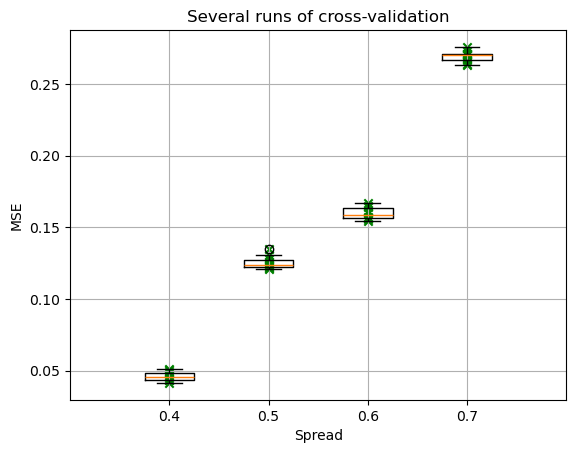

# MachLe PW 10 - Report

#### authors: Rafael Dousse, Massimo Stefani, Eva Ray

## 1. The Perceptron and the Delta rule

### 1_activation_function

> 1. Observe the shape of the different activation functions proposed.

Here are the plots of the different activation functions and their derivatives for weights 1:

  
  
  
  

> 2. Observe the effects of modifying the weight. How the shape of the function changes? How the first derivative changes?

- **Linear**: Modifying the weight changes the slope of the line. A higher weight results in a steeper slope, while a lower weight results in a flatter slope. The derivative remains constant and equal to the weight.
- **ReLU**: Modifying the weight affects the slope of the positive part of the function. A higher weight makes the positive slope steeper, while a lower weight makes it flatter. The derivative is 0 for negative inputs and equal to the weight for positive inputs.
- **Sigmoid**: Modifying the weight affects the steepness of the curve. A higher weight makes the transition from 0 to 1 steeper, while a lower weight makes it more gradual. The derivative becomes larger around the center (0.5) and smaller towards the extremes (0 and 1). The more big the weight, the more the derivate is narrow and high around 0.5. The more small the weight, the more the derivate is wide and flat.
- **Tanh**: Modifying the weight affects the steepness of the curve. A higher weight makes the transition from -1 to 1 steeper (almost binary), while a lower weight makes it more gradual. The derivative becomes larger around the center (0) and smaller towards the extremes (-1 and 1). Its maximum value is equal to the weight. The more big the weight, the more the derivate is narrow and high around 0. The more small the weight, the more the derivate is wide and flat.

### 2_perceptron

> 1. Use the sliders to change the weights of the perceptron and observe the effects on its output

For any activation function, changing the weights of the perceptron changes the values of the output. The weights determine how much influence each input has on the final output. Let's see an example for tanh activation function, where the weight of x is always 1 and we change the weight of y:

  
  
  

We can see that when the weight of y is 1, both inputs contribute positively to the output. When the weight of y is 0, only x contributes to the output. When the weight of y is -1, y contributes negatively to the output, effectively subtracting its influence. Regarding the bias, it basically shifts the output in some direction, depending on its sign.

> 2. Select different activation functions and observe the output of the perceptron for different weight configurations

Let's see the effect of different activation functions on the perceptron's output for the weights configuration where weight of x is 1 and weight of y is 1:

  
  
  
  

- **Linear**: The output increases linearly with the inputs. The perceptron produces a wide range of output values.
- **ReLU**: The output is zero for negative input combinations and increases linearly for positive input combinations. The perceptron produces non-negative output values.
- **Sigmoid**: The output is bounded between 0 and 1. The perceptron produces values that smoothly transition from 0 to 1 as the inputs increase.
- **Tanh**: The output is bounded between -1 and 1. The perceptron produces values that smoothly transition from -1 to 1 as the inputs increase.

### 3_delta_rule_points

> 1. What happens if the boundaries between both classes are well defined?

If the boundaries between both classes are well defined, the perceptron can easily learn to separate the classes using a linear decision boundary. The error decreases rapidly and converges to zero easily, as the perceptron can find a suitable set of weights to classify the points correctly. Here, we can see that we could even have done less epochs to reach convergence.

> 2. What happens if the classes overlap? What could you say about oscillations in the error signal?

If the classes overlap, the perceptron struggles to find a linear decision boundary that separates the classes perfectly. Indeed, there will always be some misclassified points due to the overlap. As a result, the error signal exhibits oscillations, as the perceptron continuously adjusts its weights in an attempt to minimize the error, but cannot achieve perfect classification. The error decreases initially but then oscillates around a certain value without converging to zero.

> 3. What happens if it is not possible to separate the classes with a single line? What could you say about local minima?

If it is not possible to separate the classes with a single line, the perceptron fails to find a suitable decision boundary. As we can see in the plot of the error, it seems like the error gets stuck in a local minimum, where further adjustments to the weights do not lead to a reduction in error. The perceptron cannot escape this local minimum because it is limited to linear decision boundaries, and thus cannot effectively classify the non-linearly separable data. This problem is impossible to solve with only one decision boundary. The solution would be to use a more complex model, such as a multi-layer perceptron, which can learn non-linear decision boundaries.

## 2. Backpropagation

## 3. Cross validation

When the spread is small (0.4), the two classes are well separated. The MLP can learn a clear decision boundary, so the MSE is very very low and almost no variability across cross-validation runs.

As the spread increases toward 0.5 and 0.6, the classes begin to overlap. This makes the classification task harder, and the median MSE rises. The boxes also become wider, showing that the performance of the network is less stable and depends more on how the training and test sets are split.

For the highest spread values, 0.7, the overlap between the two classes is stronger than the others. Many points from different classes lie close to each other, and no good boundary can perfectly separate them. We can see that in the highest MSE values across all folds, as well as a larger dispersion.

## 4. Model building

## 5. Building MLP Models using Keras Library

### 1. Balanced Dataset with Clear Separation (Blobs)

For this dataset, the decision boundary is extremely simple, and no complex architecture is required. We initially tested a large network, but progressively reduced the model size until reaching a configuration with a single neuron in the hidden layer, which already provided a perfect separation. Increasing depth or width brought no improvement and only increased computation time.

All tests were performed with 100 epochs to ensure fast experimentation. There was no indication that additional epochs would provide any benefit: training and validation losses overlapped from the earliest iterations, and no trend suggested delayed convergence.

#### Best experiments

1. 1 neuron, LR=0.01, momentum=0.99
   Mean F1 = 1.0
   The model converges immediately despite its minimal capacity. The boundary is trivial to learn, and high momentum accelerates gradient descent without instability.

#### Analysis
The dataset is too simple to differentiate models. Even extremely small architectures achieve perfect classification. Additional training epochs did not reveal any new tendencies, confirming the low complexity of the decision boundary.

### 2. Balanced Dataset with Mixed or Overlapping Classes (Circles)

The circular dataset introduces a non-linear boundary and moderate overlap, making the hyperparameters much more influential. Models with insufficient capacity underfit, whereas deeper or wider networks capture the curved boundary effectively.

#### Best experiments
  1. 16 neurons - 8 neurons - 1 neuron, LR=0.01, momentum=0.99
    Mean F1 = 0.998
    Adding a second hidden layer increases expressiveness and yields almost perfect performance. Loss and validation loss remain close throughout training, with no indication of overfitting.

  2. 16 neurons - 1 neuron, LR=0.01, momentum=0.99
    Mean F1 = 0.993
    This architecture provides enough capacity to learn the circular separation. High momentum improves convergence speed and smooths oscillations inherent to tanh activations.

  3. 16 neurons - 1 neuron, LR=0.01, momentum=0.8
  Mean F1 = 0.958
  Lower momentum reduces the optimizer’s ability to escape shallow regions of the loss landscape, slowing convergence. The model still performs well but requires more epochs to stabilize.

#### Analysis
The dataset requires non-linear expressiveness. A single small hidden layer is sufficient but deeper architectures converge faster. Overfitting does not appear even with larger configurations because the dataset is relatively clean and balanced.

### 3. Unbalanced Dataset (90/10) with Overlap and Noise

The unbalanced dataset is significantly more challenging due to the combination of class imbalance, noise, and overlapping distributions. Unlike the previous datasets, hyperparameters have a critical effect on the classifier’s ability to recover the minority class.

#### Best experiments

  1. 32 neurons - 16 neurons - 1 neuron, LR=0.005, momentum=0.5
  Mean F1 ≈ 0.43
  This configuration captures part of the minority structure but remains biased toward the majority class. Loss converges smoothly, but validation metrics show that the decision boundary remains conservative.

  2. 32 neurons - 32 neurons - 1 neuron, LR=0.005, momentum=0.5
  Mean F1 ≈ 0.43
  Increasing network width improves representation capacity but does not substantially improve minority recall. Without explicit class weighting, the optimizer remains biased toward the majority. Convergence is stable but plateaus early.

  3. 32 neurons - 16 neurons - 1 neuron, LR=0.01, momentum=0.99
  Mean F1 = 0.0
  The combination of high learning rate and high momentum causes divergence. The model collapses to predicting only the majority class. Loss decreases extremely slowly and validation loss stagnates, demonstrating a poor configuration for this data regime.

#### Analysis
This dataset highlights the limitations of tanh + MSE + SGD when facing severe imbalance. The models converge, but the minority class is under-represented in the gradient updates, yielding low F1 scores. No overfitting is observed because the network never reaches a high-capacity regime on the minority.