# MachLe PW 10 - Report

#### authors: Rafael Dousse, Massimo Stefani, Eva Ray

## 1. Digit recognition from raw data
This first part is focused on implementing three different architectures for digit recognition using the MNIST dataset. The goal is to compare the performance of different architectures and understand how the choice of layers and parameters affects the results. The model use the raw data (28x28 pixel intensities) as input features and 10 classes (digits from 0 to 9) as output.

The training set consists of 50000 samples, the validation set of 10000 samples, and the test set of 10000 samples. This is the repartition used by default in the provided notebook.

### First Model 
The first model is the architecture provided in the notebook. It is a simple multilayer perceptron. Here is the architecture:

 ```
_________________________________________________________________
 Layer (type)                Output Shape              Param #   
=================================================================
 dense (Dense)               (None, 300)               235500    
                                                                 
 dense_1 (Dense)             (None, 10)                3010      
                                                                 
=================================================================
Total params: 238510 (931.68 KB)
Trainable params: 238510 (931.68 KB)
Non-trainable params: 0 (0.00 Byte)
``` 
With: 
- Batch size: 128
- Epochs: 5 
- Optimizer: RMSprop

We already obtain an accuracy of about 0.9801 on the training set, 0.9803 on the validation set and 0.9801 on the test set. The learning curves show, continuously decreasing training loss and validation loss also decreasing, with almost no overfitting It shows already good performance for a simple architecture. 
We can see with the confusion matrix that Errors are rare but mainly occur between digits with similar shapes:

 <div style="text-align:center; flex-direction: row;">
    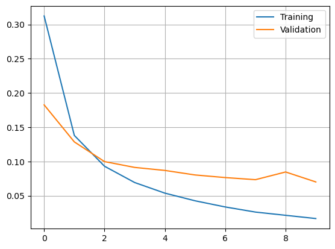
    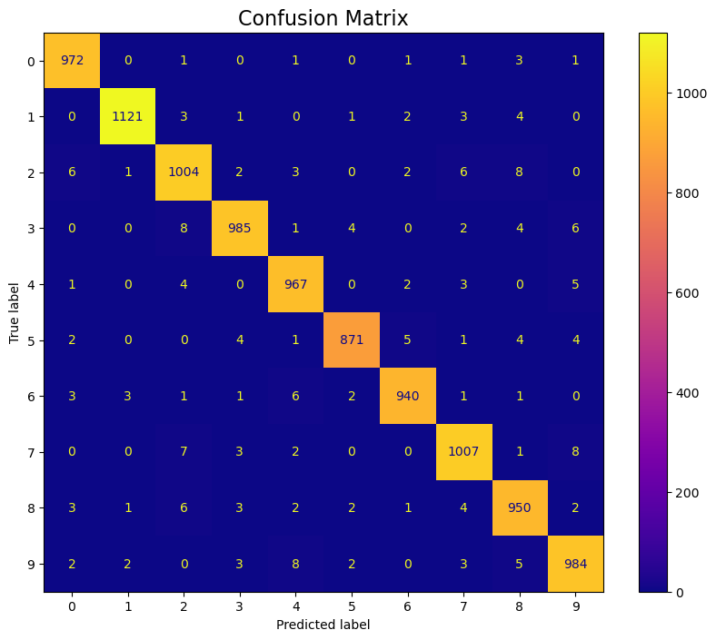
</div> 


### Second Model
The second model is a deeper architecture with dropout layers. Dropout is a regularization technique that helps prevent overfitting by randomly setting a fraction of input units to 0 at each update during training time, which helps prevent the model from relying too much on specific neurons. The architecture is as follows:

 ```
┏━━━━━━━━━━━━━━━━━━━━━━━━━━━━━━━━━┳━━━━━━━━━━━━━━━━━━━━━━━━┳━━━━━━━━━━━━━━━┓
┃ Layer (type)                    ┃ Output Shape           ┃       Param # ┃
┡━━━━━━━━━━━━━━━━━━━━━━━━━━━━━━━━━╇━━━━━━━━━━━━━━━━━━━━━━━━╇━━━━━━━━━━━━━━━┩
│ dense (Dense)                   │ (None, 300)            │       235,500 │
├─────────────────────────────────┼────────────────────────┼───────────────┤
│ dropout (Dropout)               │ (None, 300)            │             0 │
├─────────────────────────────────┼────────────────────────┼───────────────┤
│ dense_1 (Dense)                 │ (None, 10)             │         3,010 │
└─────────────────────────────────┴────────────────────────┴───────────────┘
 Total params: 238,510 (931.68 KB)
 Trainable params: 238,510 (931.68 KB)
 Non-trainable params: 0 (0.00 B)
 ```
We also reduce the batch size to 64 and increase the number of epochs to 50.
The training and validation curves show that the training loss decreases steadily over epochs but the validation loss starts around 0.09 and fluctuates slightly upward, stabilizing around 0.10–0.11 after epoch 10. This could indicates a small amount of overfitting. The gap remains limited, meaning the model generalizes reasonably well.

The final performance for the validation accuracy is around 0.982 and the test accuracy around 0.983. This is a small improvement compared to the first model, even though the architecture is still relatively small.
 
<div style="text-align:center; flex-direction: row;">
    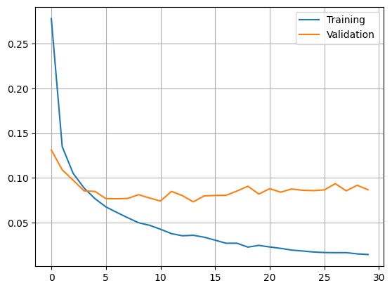
    
</div> 

### Third Model
The third model has a larger architecture with more neurons. We went from 300 neurons in the hidden layer to 1000 neurons and we kept the dropout layer. The architecture is as follows:
```
┏━━━━━━━━━━━━━━━━━━━━━━━━━━━━━━━━━┳━━━━━━━━━━━━━━━━━━━━━━━━┳━━━━━━━━━━━━━━━┓
┃ Layer (type)                    ┃ Output Shape           ┃       Param # ┃
┡━━━━━━━━━━━━━━━━━━━━━━━━━━━━━━━━━╇━━━━━━━━━━━━━━━━━━━━━━━━╇━━━━━━━━━━━━━━━┩
│ dense_15 (Dense)                │ (None, 1000)           │       785,000 │
├─────────────────────────────────┼────────────────────────┼───────────────┤
│ dropout_9 (Dropout)             │ (None, 1000)           │             0 │
├─────────────────────────────────┼────────────────────────┼───────────────┤
│ dense_16 (Dense)                │ (None, 10)             │        10,010 │
└─────────────────────────────────┴────────────────────────┴───────────────┘
Total params: 795,010 (3.03 MB)
Trainable params: 795,010 (3.03 MB)
Non-trainable params: 0 (0.00 B)
```

We tried adding more layers, but it did not improve the performance, so we kept only one hidden layer with more neurons. The batch size is still 64 and the number of epochs is 30.

The train accuracy is around 0.9957, validation accuracy is around 0.9840 and the test accuracy around 0.985. As said before, we tried with more layers and other parameters, but the performance did not improve. This model has the best performance of the three models, but the improvement is quite small compared to the second model. We can also see on the learning curves that the model tends to overfit a little as the gap between training and validation loss increases over epochs. 

 <div style="text-align:center; flex-direction: row;">
    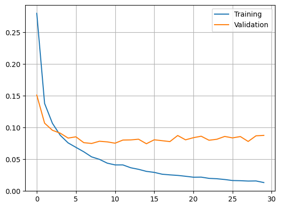
    
</div> 

### Questions

> a. Select a neural network topology and describe the inputs, indicate how many are they, and how many outputs.
 
The input of all three models consists of 784 features, corresponding to the 28×28 pixel intensity values of each MNIST image. The output layer always contains 10 neurons, one per digit class (0–9), using a `softmax` activation function.
Each model differs only in the number of hidden units and dropout layers:
- Model 1: 784 -> 300 -> 10
- Model 2: 784 -> 300 -> Dropout(0.5) -> 10
- Model 3: 784 -> 1000 -> Dropout(0.5) -> 10
  
> b. Compute the number of weights of each model (e.g., how many weights between the input and the hidden layer, how many weights between each pair of layers, biases, etc..) and explain how you get to the total number of weights.

We compute weights as: $weights = (inputs + 1) × neurons$ where the "+1" corresponds to the bias term for each neuron.

**Model 1** </br>
*Input -> Hidden (784 -> 300)*</br>
$(784+1)×300=785×300=235 500$</br>
*Hidden -> Output (300 -> 10)*</br>
$(300+1)×10=301×10=3 010$</br>
$Total\ weights = 238 510$</br>

**Model 2**:

Dropout does not add parameters.
So Model 2 has the exact same number of weights as Model 1:</br>
$Total\ weights = 238 510$

**Model 3**: </br>

*Input -> Hidden (784 -> 1000)*</br>
$(784+1)×1000=785000$</br>
*Hidden -> Output (1000 -> 10)*</br>
$(1000+1)×10=1001×10=10010$</br>
$Total\ weights = 795 010$</br>


> c. Comment the differences in results for the three models. Are there particular digits that are frequently  confused?

|Model|	Validation Accuracy|	Test Accuracy|	Remarks|
|-----|---------------------|--------------|--------|
|1    |	~0.980              |	~0.980     | Good baseline, very limited overfitting.|
|2    |	~0.982              |	~0.983     | Slight improvement thanks to dropout + longer training.|
|3    |	~0.984              |	~0.985     | Best accuracy, but only marginally better. Overfitting starts to appear.|
Increasing the number of neurons improves performance, but the gains become very small because MNIST is a relatively simple dataset and a shallow MLP already performs very well.

Across all three confusion matrices, the same patterns appear:
`3-5`, `5-3`, `4-9`, `9-4`, `3-9` and `2-7` are the most confused digit pairs.
The pairs might be confused due to similar curvature and orientation or share similar straight lines. For example, some handwritten 3 can look like a 5. For the 4 and the 9 pair, the top part of the 4 can be mistaken for the loop of the 9. 

Model 3 reduces the number of mistakes but does not eliminate these specific ambiguous cases.

## 2. Digit recognition from features of the input data

All the models will be integrated with a dropout layer after the hidden layer with a dropout rate of 0.5 to prevent overfitting.

### First Model 

#### 300 neurons in the hidden layer

```
_________________________________________________________________
 Layer (type)                Output Shape              Param #   
=================================================================
 dense (Dense)               (None, 300)               117900    

 dropout_1 (Dropout)         (None, 300)               0         
                                                                 
 dense_1 (Dense)             (None, 10)                3010      
                                                                 
=================================================================
Total params: 120910 (472.30 KB)
Trainable params: 120910 (472.30 KB)
Non-trainable params: 0 (0.00 Byte)
_________________________________________________________________
```

With: 
- Batch size: 128
- Epochs: 5 
- Optimizer: RMSprop

#### Results

<div style="text-align:center; flex-direction: row;">
    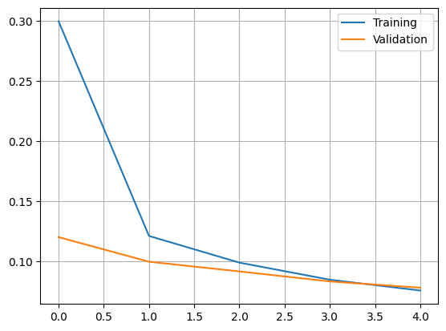
    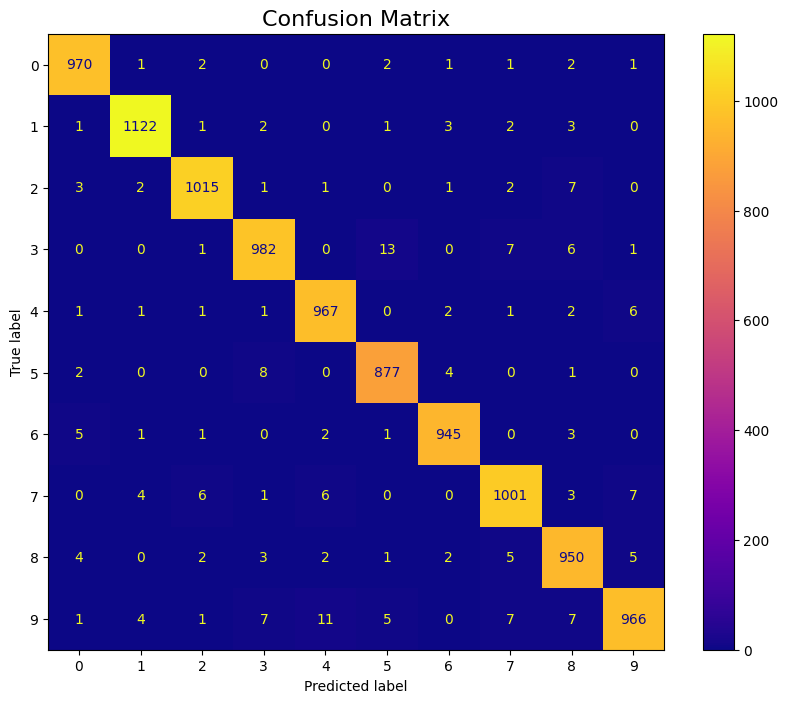
</div> 

##### Capacity.

The model contains ~121k parameters, which is significantly high considering the simplicity of the MNIST-HOG feature space. This parameter count results from the dense projection of the input HOG vector into a 300-unit latent space, plus the output head. Such capacity is already sufficient to nearly saturate MNIST performance.

##### Performance.

```
Test score: 0.06717927008867264
Test accuracy: 0.9781000018119812
```

The network converges efficiently and already reaches an excellent accuracy. However, the parameter-efficiency ratio is poor: we spend 121k parameters for a marginal advantage over slimmer networks. Given the assignment objective, this model is clearly over-provisioned.


### Second Model

#### 128 neurons in the hidden layer

```
_________________________________________________________________
 Layer (type)                Output Shape              Param #   
=================================================================
 dense_2 (Dense)             (None, 128)               50304     
                                                                 
 dropout_1 (Dropout)         (None, 128)               0         
                                                                 
 dense_3 (Dense)             (None, 10)                1290      
                                                                 
=================================================================
Total params: 51594 (201.54 KB)
Trainable params: 51594 (201.54 KB)
Non-trainable params: 0 (0.00 Byte)
_________________________________________________________________
```

With: 
- Batch size: 128
- Epochs: 5 
- Optimizer: RMSprop


#### Results

<div style="text-align:center; flex-direction: row;">
    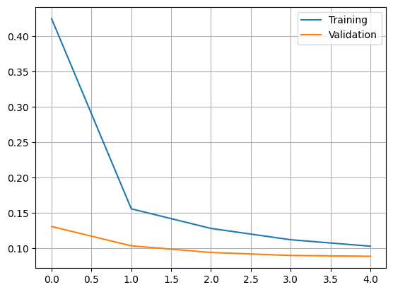
    
</div>

##### Capacity.

This architecture drops to ~52k parameters, reducing the model size by more than half while keeping the same conceptual structure.

##### Performance.

```
Test score: 0.07203482836484909
Test accuracy: 0.9771999716758728
```

The accuracy is essentially comparable to Model 1 despite the massive parameter reduction.
However, the loss curve shows the training had not plateaued at epoch 5, indicating that the optimization is incomplete. This is consistent with your remark that the curve continues to descend.

### Third Model

#### 128 neurons in the hidden layer with 8 epochs

```
_________________________________________________________________
 Layer (type)                Output Shape              Param #   
=================================================================
 dense_2 (Dense)             (None, 128)               50304     
                                                                 
 dropout_1 (Dropout)         (None, 128)               0         
                                                                 
 dense_3 (Dense)             (None, 10)                1290      
                                                                 
=================================================================
Total params: 51594 (201.54 KB)
Trainable params: 51594 (201.54 KB)
Non-trainable params: 0 (0.00 Byte)
_________________________________________________________________
```

With: 
- Batch size: 128
- Epochs: 8 
- Optimizer: RMSprop


#### Results

<div style="text-align:center; flex-direction: row;">
    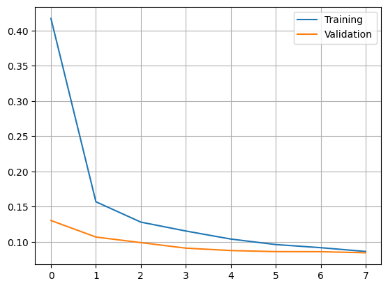
    
</div> 

##### Capacity.

The model has the same ~52k parameters as Model 2.

##### Performance.

```
Test score: 0.06717927008867264
Test accuracy: 0.9781000018119812
```

By extending training to 8 epochs, you obtain a lower loss and higher accuracy than Model 2, and near Model 1 despite using less than half the parameters. The convergence curves confirm that additional epochs improve generalization without inducing overfitting at this scale.


### Questions

> a. Select a neural network topology and describe the inputs, indicate how many are they, and how many outputs.

The model processes HOG feature vectors extracted from the MNIST images. 

- Inputs:
The network receives a vector of size hog_size.
Each input dimension corresponds to one HOG coefficient computed from the gradient histogram representation.

- Outputs:
The final dense layer contains 10 units, one per digit class (0–9).
A softmax activation is used to produce normalized class probabilities.

- Topology:
The selected architecture is a shallow MLP composed of:

    - One fully-connected hidden layer with 128 neurons (ReLU)

    - One dropout layer

    - One output dense layer with 10 neurons (softmax)

    ```
    Dense(128, input_shape=(hog_size,), activation='relu')
    Dropout(0.5)
    Dense(10, activation='softmax')
    ```

> b. Compute the number of weights of each model (e.g., how many weights between the input and the hidden layer, how many weights between each pair of layers, biases, etc..) and explain how you get to the total number of weights.

    - hog_size = dimensionality of the input vector

    - H = 128 = number of hidden units

    - C = 10 = number of classes

- Weights between input layer and hidden layer
Each hidden neuron has hog_size incoming weights plus one bias.

    - Total parameters: (hog_size × 128) + 128

- Weights between hidden layer and output layer
Each of the 10 output neurons receives 128 weights plus one bias.

    - Total parameters: (128 × 10) + 10

- Total number of parameters

```
Total = (hog_size × 128 + 128) + (128 × 10 + 10) = 128 × (hog_size + 1) + 10 × (128 + 1)
```

> c. Comment the differences in results for the three models. Are there particular digits that are frequently  confused?

|Model|	Validation Accuracy|	Test Accuracy|	Remarks|
|-----|---------------------|--------------|--------|
|1    |	~0.979              |	~0.979     | High capacity (~121k params) leads to strong performance but poor parameter efficiency.|
|2    |	~0.977              |	~0.977     | Slimmer model (~52k params) achieves comparable accuracy, but training incomplete at 5 epochs.|
|3    |	~0.978              |	~0.978     | Same capacity as Model 2, but extended training (8 epochs) improves performance close to Model 1.|

All three models achieve strong accuracy around 97.7–97.9% on MNIST-HOG, demonstrating that even a small MLP can effectively leverage HOG features for digit recognition.

Let's place a threshold of 10 misclassifications to identify frequently confused digit pairs from the confusion matrices.

- Model 1
    -  He says 5 instead of 3 - 13 times
    -  He says 4 instead of 9 - 11 times

- Model 2
    -  He says 9 instead of 4 - 12 times
    -  He says 9 instead of 7 - 10 times

- Model 3
    -  He says 9 instead of 4 - 13 times
    -  He says 3 instead of 5 - 12 times

The misclassifications observed across the three models primarily concern digit pairs that share similar local gradient structures in their HOG representations. The most frequent errors involve confusions between 3 and 5, and between 4 and 9, with additional cases such as 7 being predicted as 9. These pairs exhibit overlapping dominant orientations once the image is reduced to HOG descriptors, which removes fine spatial details and makes certain handwritten styles nearly indistinguishable for a shallow MLP. Increasing the number of parameters (Model 1) or extending the training duration (Model 3) does not fundamentally change the nature of these confusions, indicating that they stem from the feature representation rather than model capacity. As a result, these systematic errors are expected and reflect the intrinsic limitations of using HOG features with a fully connected architecture.

## 3. Convolutional neural network digit recognition

In this section, we implement three different CNN architectures for digit recognition using the MNIST dataset. The goal is to compare the performance of different architectures and understand how the choice of layers and parameters affects the results. All the following models use pixels from 28x28 images as input data, which represents an input size of 784 features. The possible outputs are the digits from 0 to 9, resulting in 10 output classes.

The training set consists of 50000 samples, the validation set of 10000 samples, and the test set of 10000 samples. This is the repartition used by default in the provided notebook.

### First Model 

The first analyzed model is the model given by default in the notebook. It has the following architecture:

 ```
 _________________________________________________________________
 Layer (type)                Output Shape              Param #   
=================================================================
 l0 (InputLayer)             [(None, 28, 28, 1)]       0         
                                                                 
 l1 (Conv2D)                 (None, 28, 28, 9)         234       
                                                                 
 l1_mp (MaxPooling2D)        (None, 14, 14, 9)         0         
                                                                 
 l2 (Conv2D)                 (None, 14, 14, 9)         2034      
                                                                 
 l2_mp (MaxPooling2D)        (None, 7, 7, 9)           0         
                                                                 
 l3 (Conv2D)                 (None, 7, 7, 16)          1312      
                                                                 
 l3_mp (MaxPooling2D)        (None, 3, 3, 16)          0         
                                                                 
 flat (Flatten)              (None, 144)               0         
                                                                 
 l4 (Dense)                  (None, 25)                3625      
                                                                 
 l5 (Dense)                  (None, 10)                260       
                                                                 
=================================================================
Total params: 7465 (29.16 KB)
Trainable params: 7465 (29.16 KB)
Non-trainable params: 0 (0.00 Byte)
 ```

 - Batch size: 128
 - Epochs: 5 
 - Optimizer: RMSprop

 The accuracy of this model on the train set is about 0.9742, which is a strong start. As we can see on the history plot below, the model is not overfitting and the validation loss is still decreasing at the end of the training, so we can try to increase the number of epochs to improve the performance.

 <div style="text-align:center; flex-direction: row;">
    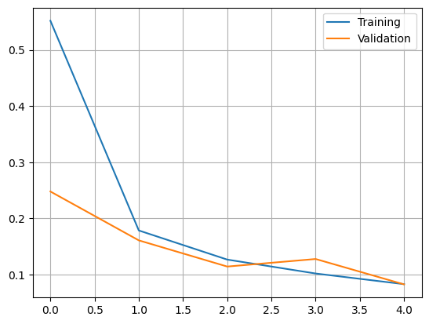
    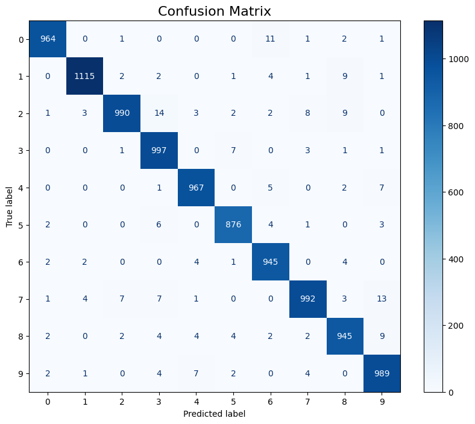
</div> 

### Second Model

For the second model, we first simply increased the epochs to 50. However, the model tends to overfit pretty quickly, so we added Dropout layers after the flatten layer and after the first dense layer with a dropout rate of 0.3. This helps with overfitting because it randomly sets a fraction of input units to 0 at each update during training time, which helps prevent the model from relying too much on specific neurons. With this new architecture, we obtained an accuracy of 0.9862 on the test set, which is a significant improvement considering the high accuracy of the first model. The history plot and confusion matrix are shown below:

<div style="text-align:center; flex-direction: row;">
    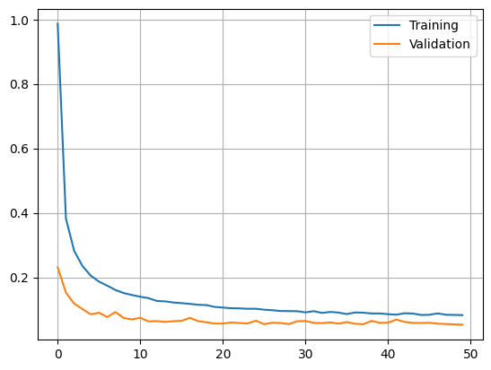
    
</div> 

### Third Model

For the third model, the goal is to try a more drastic change in the architecture like adding more filters, changing the kernel size, adding more convolutional layers, changing the batch size, or adding batch normalization layers. In the table below, we summarize the different architectures we tried as well as their performance on the test set and our observations regarding overfitting. 

| Test Accuracy | Architecture                                                                                                 | Observations                       |
|---------------|------------------------------------------------------------------------------------------------------------------------|------------------------------------|
| 0.9944        | 32 filters, 5x5 → 64 filters, 5x5 → 128 filters, 3x3, batch size 128                                                   | Overfitting quickly                |
| 0.9922        | 32 filters, 3x3 → 64 filters, 3x3 → 128 filters, 3x3, batch size 128                                                   | Overfitting still present but less |
| 0.9936        | 32 filters, 5x5 → 64 filters, 5x5 → 128 filters, 3x3, batch size 256                                                   | Almost no overfitting              |
| **0.9938**        | 32 filters, 3x3 → 64 filters, 3x3 → 128 filters, 3x3, batch size 256, SGD optimizer (momentum 0.9)                                 | **Almost no overfitting**              |
| 0.9923        | 32 filters, 3x3 → 64 filters, 3x3 → 128 filters, 3x3, batch normalization after each convolution layer, batch size 128 | Overfitting still present but less |
| 0.9915        | 32 filters, 3x3 → 64 filters, 3x3 → 128 filters, 3x3 → 256 filters, 3x3, batch size 128                                | Overfitting very quickly           |

The best performing model is the one with 32 filters of size 3x3 in the first convolutional layer, followed by 64 filters of size 3x3 in the second convolutional layer, and finally 128 filters of size 3x3 in the third convolutional layer. We also used a batch size of 256, the SGD optimizer with a momentum of 0.9, dropout layers with a dropout rate of 0.3 after the flatten layer and after the first dense layer and 50 epochs. This model achieved an accuracy of 0.9938 on the test set, which is a significant improvement over the previous models. The test score is 0.0212. The history plot and confusion matrix are shown below:

<div style="text-align:center; flex-direction: row;">
    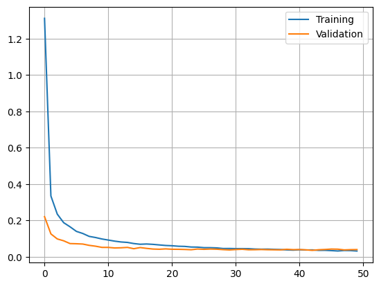
    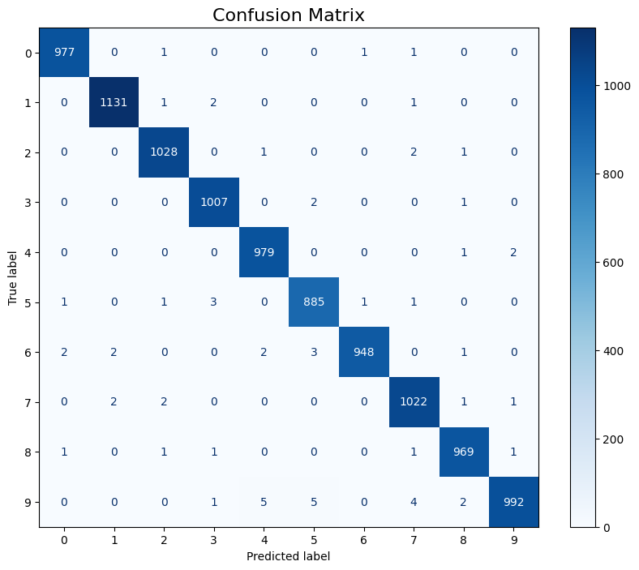
</div> 

### Questions

> a. Select a neural network topology and describe the inputs, indicate how many are they, and how many outputs.

The selected neural network topology is the third model described above.

- **Inputs**: The input to the model is a grayscale image of size 28x28 pixels. Each pixel is represented by a single value (intensity) ranging from 0 to 255. Therefore, the total number of input features is 28 * 28 = 784.
- **Outputs**: The output of the model is a probability distribution over 10 classes, corresponding to the digits 0 to 9. Therefore, there are 10 output neurons in the final dense layer, each representing the probability of the input image belonging to one of the digit classes.

> b. Compute the number of weights of each model (e.g., how many weights between the input and the hidden layer, how many weights between each pair of layers, biases, etc..) and explain how you get to the total number of weights.

We will go through the calculation of the number of weights for each layer in the selected model:
- **First Convolutional Layer (Conv2D with 32 filters of size 3x3)**: (3 * 3 * 1) * 32 + 32 = 320
- **Second Convolutional Layer (Conv2D with 64 filters of size 3x3)**: (3 * 3 * 32) * 64 + 64 = 18,496
- **Third Convolutional Layer (Conv2D with 128 filters of size 3x3)**: (3 * 3 * 64) * 128 + 128 = 73,856
- **First Dense Layer (Dense with 25 neurons)**: (3 * 3 * 128) * 25 + 25 = 28,825
- **Second Dense Layer (Dense with 10 neurons)**: (25) * 10 + 10 = 260
- **Total number of parameters in the model**: 320 + 18,496 + 73,856 + 28,825 + 260 = 121,757

Basically, we have:
- For convolutional layers: (filter_height * filter_width * input_channels) * number_of_filters + number_of_filters (for biases)
- For dense layers: (number_of_input_neurons) * (number_of_output_neurons) + number_of_output_neurons (for biases)

> c. Comment the differences in results for the three models. Are there particular digits that are frequently  confused?

The first model achieved a good accuracy of 0.9742, which indicates that CNNs are effective for digit recognition tasks. However, there was still room for improvement. The second model, which incorporated dropout layers to mitigate overfitting, significantly improved the accuracy to 0.9862, showing that the model benefited from being trained for more epochs and that dropout helped avoid overfitting. Finally, the third model, which involved more extensive architectural changes such as increasing the number of filters, changing kernel sizes, and using a different optimizer (SGD with momentum), achieved the highest accuracy of 0.9938. This demonstrates that deeper architectures with more parameters can capture more complex features in the data, leading to better performance, although it can also lead to overfitting. In our case, we can see on the loss history plot that the model almost don't overfit at all, which is due to the dropout layers and the larger batch size. This is ideal, since it means the model generalizes well to unseen data.

<div style="text-align:center; flex-direction: row;">
    
    
</div> 

Now, let's take a look at the confusion matrix of the third model. We can see that there are very few misclassifications but when they do occur, they tend to happen between digits that are visually similar. For example, '5' and '3', '2' and '7',  '4' and '9', '5' and '6' and '9' and '5' are sometimes confused with each other. This is likely due to the fact that these digits share similar shapes and features, making it challenging for the model to distinguish between them in certain cases. These misclassifications indicates that the model could benefit from further fine-tuning or additional training data to better learn the features that differentiate these similar digits. However, with an accuracy of 0.9938, it will be difficult to achieve significant improvements, as the model is already performing at a very high level. Furthermore, overfitting is a real challenge for this task when trying to push the accuracy even higher, as it is quite hard to keep it under control.

## 4. Chest X-ray to detect pneumonia

> Train a CNN for the chest x-ray pneumonia recognition. In order to do so, complete the code to reproduce the architecture plotted in the notebook. Present the confusion matrix, accuracy and F1-score of the validation and test datasets and discuss your results.

In this final part, a convolutional neural network (CNN) was trained to classify chest X-ray images into normal and pneumonia. The dataset contains highly imbalanced classes, so class weights were computed to compensate for the lower number of normal samples. All images were converted to grayscale and resized to 128×128 before training.
The CNN architecture follows the structure provided in the notebook: a sequence of convolution + max-pooling blocks, followed by a flattening layer and two dense layers, ending with a sigmoid output for binary classification.

**Validation Results**

The validation set is very small (16 images), and the model correctly classified all samples:

- Confusion matrix:
    - Normal: 8/8 — Pneumonia: 8/8
- Accuracy: 1.0
- F1-score: 1.0

This perfect score isn't very meaningful due to the tiny validation set size.

**Test Results**

On the much larger test set (624 images), performance is more representative:

- Confusion matrix:
    - Normal -> predicted normal: 103 and predicted pneumonia: 131
    - Pneumonia -> predicted normal: 3 and predicted pneumonia: 387
- Accuracy: 0.78
- F1-score: 0.85

<div style="text-align:center; flex-direction: row;">
    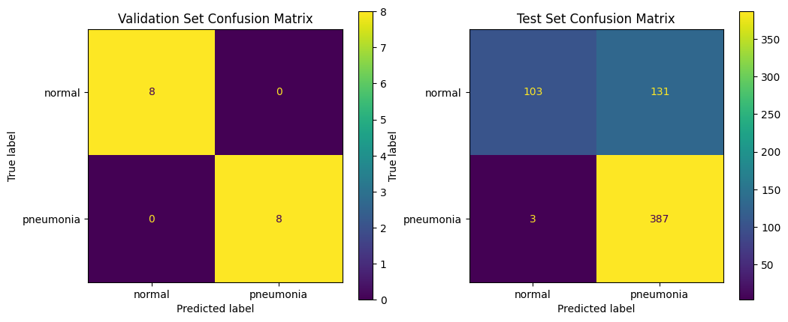
</div> 

The model detects pneumonia very well (few false negatives), but it often misclassifies normal lungs as pneumonia. This is probably due to the class imbalance, the model becomes biased toward the majority class.

We can say that overall, the CNN generalizes quite well given the difficulty of the dataset and the imbalance between classes. It is more sensible to pneumonia which could be desirable in a medical context, but the number of false positives suggests that additional improvements like data augmentation or more advanced architectures could be beneficial.

## General questions

### Question 1

> What is the learning algorithm being used to train the neural networks?

The algorithm used by default to optimize the weights is RMSprop. RMSprop is an optimization algorithm used to adjust the weights of a neural network. It adapts the learning rates of the weights by using a moving average of the squared previous gradients, which allows faster convergence and improves learning performance.

<div style="text-align:center">
    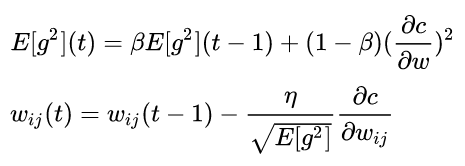
</div>

where:

- $E[g]$ is the moving average of the squared gradients
- $\frac{\delta c}{\delta w}$ is the gradient of the cost function with respect to the weight
- $\eta$ is the learning rate
- $\beta$ is the moving average parameter

> What are the parameters (arguments) being used by that algorithm?

The parameters used in the ``RMSprop`` optimizer can be found in the `Keras` documentation and are as follows:

```python
keras.optimizers.RMSprop(
    learning_rate=0.001,
    rho=0.9,
    momentum=0.0,
    epsilon=1e-07,
    centered=False,
    weight_decay=None,
    clipnorm=None,
    clipvalue=None,
    global_clipnorm=None,
    use_ema=False,
    ema_momentum=0.99,
    ema_overwrite_frequency=None,
    loss_scale_factor=None,
    gradient_accumulation_steps=None,
    name="rmsprop",
    **kwargs
)
```

> What cost function is being used? 

The cost function used is the categorical cross-entropy loss function. This function is commonly used for multi-class classification problems, where the goal is to predict the class label of an input from multiple possible classes. The categorical cross-entropy loss measures the difference between the predicted probability distribution and the true distribution (one-hot encoded labels) and penalizes incorrect predictions more heavily. The equation for the categorical cross-entropy loss is given by:

$$L = -\sum(y \cdot \log(\hat{y}))$$

where:
- $L$ is the loss
- $y$ is the true label (one-hot encoded)
- $\hat{y}$ is the predicted probability distribution

> How did you create the training, validation and test datasets.

### Question 2

See in each experiment section.

### Question 3

> Do the deep neural networks have much more “capacity” (i.e., do they have more weights?) than the shallow ones? Explain with one example.

In general, deeper convolutional neural networks tend to have more weights than shallow models. This comes from the fact that deeper CNNs usually include a larger number of layers, and each convolution layer contains several filters that hold weights. However, this is not always true and depends on the specific model configuration. For example, a shallow model with several layers and many neurons may end up with more weights than a CNN that has only one convolution layer using small filters. 

### Question 4

See the section for part 4.

