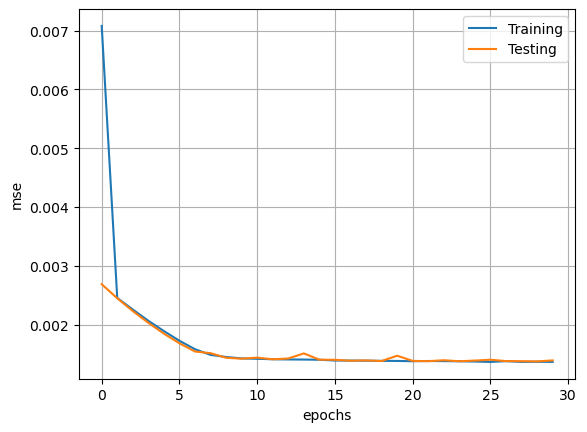
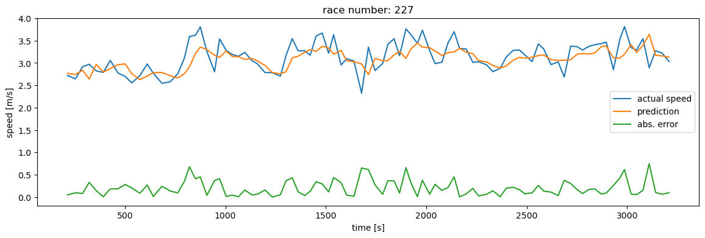
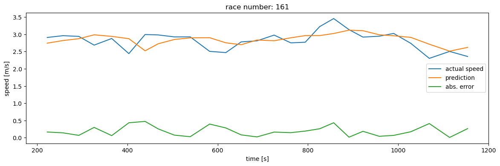
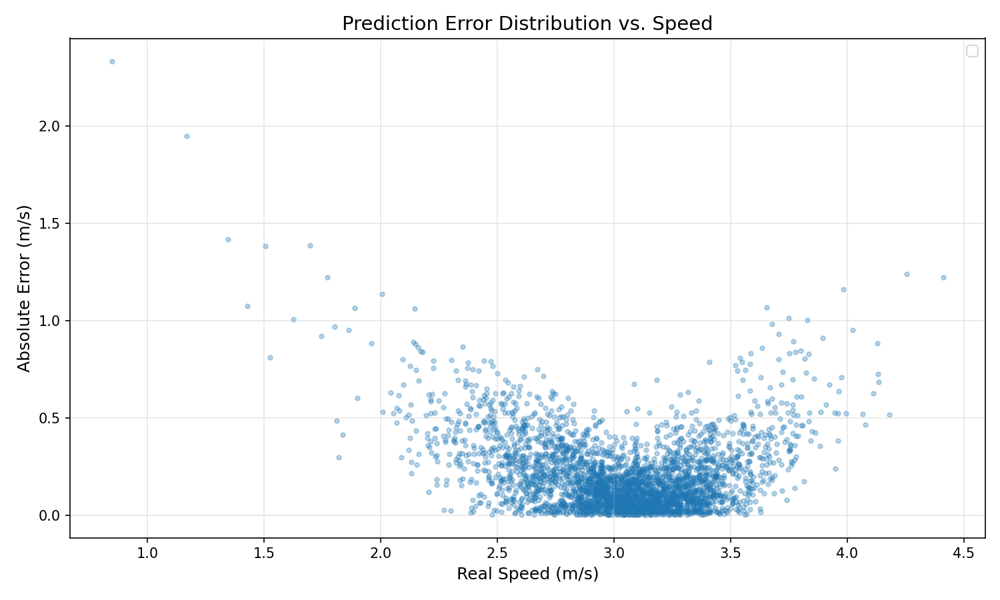

# MachLe PW 12 - Report

#### authors: Rafael Dousse, Massimo Stefani, Eva Ray

## 3. Race Time Prediction

> 1. Explore different number of LSTM units, different lengths of previous data (sequence length) and training epochs. Show the configuration that performed the best. Observe the resulting complexity of the network (e.g., number of trainable parameters)

We tested different configurations of the LSTM network by varying the number of time steps, number of epochs, and number of LSTM units. Below is a summary table of our experiments along with their results:

| Time steps | Batch size | Epochs | Units | Trainable params | Training corr. | Test corr. | Observations |
|-----------|------------|--------|-------|-------------------|----------------|------------|--------------|
| 10        | 64         | 20     | 1     | 22                | 0.62           | 0.621      | MSE drops quickly and stabilizes around 5 epochs. |
| 20        | 64         | 20     | 1     | 22                | 0.313          | 0.3        | Predicted curve does not follow the ups and downs, stays almost flat. |
| 5         | 64         | 20     | 1     | 22                | 0.621          | 0.647      | MSE is still decreasing at 20 epochs, predicted curve is more reactive and follows the variations well. |
| 5         | 64         | 30     | 5     | 186               | **0.64**           | **0.65**       | MSE drops quickly, predicted curve follows the variations well. |
| 5         | 64         | 30     | 16    | 1297              | 0.638          | 0.645      | MSE drops quickly, predicted curve follows the variations well. |

The best model configuration we found was with 5 time steps, 30 epochs, and 5 LSTM units, achieving a training correlation of 0.64 and a test correlation of 0.65. That said, configurations that focused on increasing the number of units did not lead to significant improvements and neither to worse performance. 

After doing these experiments, we concluded the following:
- Increasing the number of time steps beyond 10 did not improve performance; in fact, it led to worse results. A possible explanation is that with more time steps, the model may struggle to capture relevant patterns due to increased complexity. It can maybe lead to having a view of the past that is too far away to be relevant for predicting the next speed.
- Increasing the number of epochs beyond 30 did not lead to better performance, as the MSE stabilized quickly.
- Increasing the number of LSTM units beyond 5 did not lead to significant improvements, suggesting that the model was already sufficiently complex to capture the necessary patterns in the data.
- The correlation coefficients we obtained were around 0.65, which is decent but indicates that there is still room for improvement in the model's predictive capabilities. However, the task at hand is quite challenging.

On the mse history plot below, we can see that the mse decreases quickly and stabilizes after a few (around 10) epochs. This suggests that we maybe could have stopped training earlier to save time but when we tried, it lead to slightly worse performance, probably due to the random initialization of the weights. The plot also show that there is no overfitting happening as the validation loss follows closely the training loss.

<div style="text-align:center; flex-direction: row;">
    
</div> 

Let's take a look at the predicted speed for a random race (here, race 227) and compare it to the real speed. We can see that the predicted curve follows the real speed quite well, capturing the main variations. It is interesting to note that the predicted speed curve seems to be "delayed" compared to the real speed curve. This could be due to the fact that the model is using past data to make predictions, and there may be a lag in how quickly it can respond to changes in speed. Furthermore, the model seems to smooth out some of the more abrupt changes in speedm sometimes underestimating peaks. This could be due to the model's attempt to generalize from the training data, leading to a more averaged prediction. The absolute error plot shows that the errors are generally small, but there are some instances where the error is larger, particularly during rapid changes in speed.

<div style="text-align:center; flex-direction: row;">
    
</div> 

To conclude, it is interesting to note that the model performs better on "easy" races, where the speed profile is relatively smooth and does not have many abrupt changes. In these cases, the model can probably capture the underlying patterns more effectively. The plot below shows the predicted speed for an easy race, an we can see that the predicted curve closely follows the real speed, with smaller errors compared to the previous example. In general, the "noisiness" of the error is related to how "noisy" the speed profile is itself.

<div style="text-align:center; flex-direction: row;">
    
</div> 

> 2. What is the largest error (speed prediction) you observed? Do you observe that most of those large errors show up for high speeds ? or low speeds? Why?

We have performed more tests to analyze the prediction errors of our LSTM model.

```
configurations = [
    {'units': 1, 'epochs': 30, 'timesteps': 20},
    {'units': 5, 'epochs': 30, 'timesteps': 20},
    {'units': 10, 'epochs': 30, 'timesteps': 20},
    {'units': 20, 'epochs': 30, 'timesteps': 20},
    {'units': 50, 'epochs': 30, 'timesteps': 20},

    {'units': 5, 'epochs': 10, 'timesteps': 20},
    {'units': 5, 'epochs': 20, 'timesteps': 20},
    {'units': 5, 'epochs': 40, 'timesteps': 20},
    {'units': 5, 'epochs': 60, 'timesteps': 20},
    
    {'units': 5, 'epochs': 30, 'timesteps': 5},
    {'units': 5, 'epochs': 30, 'timesteps': 10},
    {'units': 5, 'epochs': 30, 'timesteps': 15},
    {'units': 5, 'epochs': 30, 'timesteps': 25},
    {'units': 5, 'epochs': 30, 'timesteps': 30},
    
    {'units': 5, 'epochs': 50, 'timesteps': 10},
    {'units': 10, 'epochs': 40, 'timesteps': 15},
    {'units': 3, 'epochs': 30, 'timesteps': 15},
]

```

And the results are the following:

| Index | Config                                   | Train Corr | Test Corr | Final Val Loss |
|-------|-------------------------------------------|------------|-----------|----------------|
| 15    | {'units': 10, 'epochs': 40, 'timesteps': 15} | 0.668288   | 0.653115  | 0.001244       |
| 4     | {'units': 50, 'epochs': 30, 'timesteps': 20} | 0.662517   | 0.648737  | 0.001229       |
| 11    | {'units': 5, 'epochs': 30, 'timesteps': 15}  | 0.664255   | 0.647758  | 0.001219       |
| 8     | {'units': 5, 'epochs': 60, 'timesteps': 20}  | 0.661370   | 0.645897  | 0.001218       |
| 3     | {'units': 20, 'epochs': 30, 'timesteps': 20} | 0.658972   | 0.644188  | 0.001230       |
| 7     | {'units': 5, 'epochs': 40, 'timesteps': 20}  | 0.659346   | 0.641615  | 0.001320       |
| 14    | {'units': 5, 'epochs': 50, 'timesteps': 10}  | 0.654782   | 0.638770  | 0.001254       |
| 10    | {'units': 5, 'epochs': 30, 'timesteps': 10}  | 0.653649   | 0.637922  | 0.001246       |
| 16    | {'units': 3, 'epochs': 30, 'timesteps': 15}  | 0.655186   | 0.635338  | 0.001273       |
| 12    | {'units': 5, 'epochs': 30, 'timesteps': 25}  | 0.658046   | 0.630283  | 0.001254       |
| 13    | {'units': 5, 'epochs': 30, 'timesteps': 30}  | 0.656121   | 0.629981  | 0.001299       |
| 1     | {'units': 5, 'epochs': 30, 'timesteps': 20}  | 0.651540   | 0.629186  | 0.001286       |
| 2     | {'units': 10, 'epochs': 30, 'timesteps': 20} | 0.654543   | 0.629168  | 0.001302       |
| 9     | {'units': 5, 'epochs': 30, 'timesteps': 5}   | 0.640310   | 0.628322  | 0.001329       |
| 5     | {'units': 5, 'epochs': 10, 'timesteps': 20}  | 0.648983   | 0.627205  | 0.001270       |
| 6     | {'units': 5, 'epochs': 20, 'timesteps': 20}  | 0.641525   | 0.615486  | 0.001305       |
| 0     | {'units': 1, 'epochs': 30, 'timesteps': 20}  | 0.570225   | 0.568618  | 0.001470       |

Best configuration: `units=10, epochs=40, timesteps=15` achieved the highest test correlation (0.653), though configurations with `units=5` showed comparable performance with lower complexity.

Using the best performing configuration, we analyzed prediction errors across all test races:

- Maximum error observed: 5.764 m/s  
- Speed at maximum error: 0.848 m/s

Speed categories may be defined as follows:

- Mean Error for low speeds (0-2 m/s): 1.065 m/s
- Mean Error for medium speeds (2-3 m/s): 0.240 m/s  
- Mean Error for high speeds (>3 m/s): Mean = 0.171 m/s

<div style="text-align:center;">
    
</div>

We can see that largest errors occur at low speeds, not high speeds.

- Why do low speeds cause large errors?

Low speeds (0-2 m/s) happen during steep uphill sections, at the start/end of races, or during abrupt transitions. In these situations, runners behave very differently from one another - some walk, others push through slowly, and pacing strategies vary significantly.

The dataset also plays a role. Runners spend most of their race time at medium to high speeds, so the model sees many more training examples in that range. Low-speed sections are relatively rare in the data, which means the model hasn't learned to handle them as well.

Another issue is the LSTM's tendency to smooth predictions based on recent history. When a runner suddenly slows down on a steep hill, the model still "remembers" the previous higher speeds and underestimates how much the runner will slow down. It takes several prediction steps for the model to catch up to reality. This lag is visible in our prediction plots - the model consistently reacts too slowly to rapid changes.

At medium and high speeds (2-4 m/s), the relationship between slope and speed is much more consistent. Runners maintain steady pacing strategies, and there's less individual variation. At low speeds, factors like fatigue, whether someone chooses to walk or run, and individual fitness levels create a lot more noise in the data.

- The maximum error case

The maximum error of 5.764 m/s occurred when the runner was moving at only 0.848 m/s. This means the model predicted roughly 6.6 m/s while the runner had actually slowed to a near-walk. This likely happened when the runner hit a sudden steep uphill - the model, expecting normal running speeds based on recent data, completely missed the dramatic slowdown.

- What could improve this?

To handle low speeds better, we could oversample those sections during training to give the model more examples to learn from. Adding features like the rate of elevation change  might help the model anticipate transitions. Additional data like heart rate or power output would also help if available.

The current model works well for steady-state running but struggles with rapid transitions, especially sudden decelerations.


> 3. Using the predicted speeds for a given race, compute the expected time for a race and compute the difference between the real race time and the predicted race time in minutes. Provide the code of the cell that computes this prediction error.