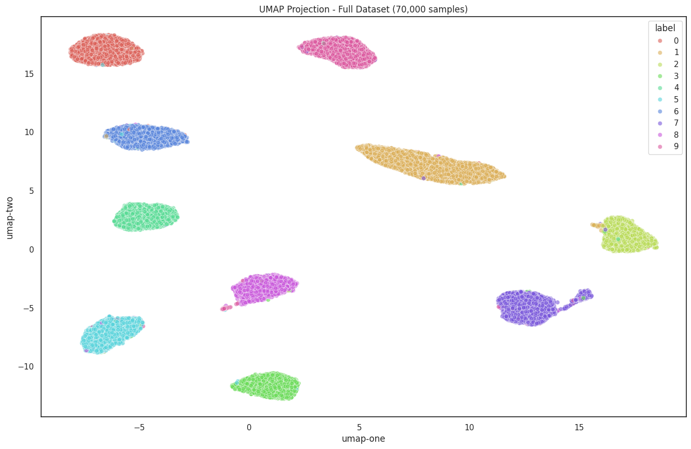

# MachLe PW 13 - Report

#### authors: Rafael Dousse, Massimo Stefani, Eva Ray

## 1. PCA

### Question 1: Scatter Matrix and Best Variable Pair

> Provide the scatter matrix and select the pair of variables (by visual inspection of the scatter matrix) that appears to allow the recognition of the three classes of wine. Explain.


By visual inspection of the scatter matrix of the 13 original features, the best pair of variables for separating the three wine classes appears to be EV7 and EV13.

When plotted in the scatter matrix, these variables exhibit clear cluster separation with minimal overlap between classes. The red, green, and blue points (representing the three wine classes) occupy distinct regions of the feature space, making visual classification straightforward.

### Question 2: PCA Variance Explained

> After performing a PCA on the wine dataset, what is the percentage of the variance of the data explained by each one of the first 3 principal components? And the accumulated explained variance?

After performing PCA on the wine dataset, the variance explained by the first 3 principal components is:

**Individual variance explained:**
- PC1: 36.20% of the total variance
- PC2: 19.21% of the total variance
- PC3: 11.12% of the total variance

**Cumulative variance explained:**
- PC1: 36.20%
- PC1-PC2: 55.41%
- PC1-PC3: 66.53%

The first principal component captures more than one-third of the total variance in the dataset, representing the primary direction of variability. The second component captures an additional 19.21% of variance in a direction orthogonal to PC1. Together, the first three components explain approximately two-thirds (66.53%) of the total variance in the original 13-dimensional data, demonstrating that PCA effectively captures most of the information while reducing dimensionality by 77% (from 13 to 3 features).

### Question 3: MLP Classification Comparison

> Randomly split the dataset into train (80%) and test (20%) datasets. Train a Multi-layer Perceptron to classify the wine types using the complete set of variables and compare the performance of a model that only uses the 3 principal components (provide the confusion matrices and compare accuracies and F1-score values).

We trained Multi-layer Perceptron classifiers on both the complete set of variables and on 3 principal components. The dataset was randomly split into 80% training and 20% testing sets with stratification to maintain class proportions.

**Results:**


**Comparison:**
Remarkably, the MLP using only 3 PCA components (capturing 66.53% of variance) achieves identical performance to the model using all 13 original features:
- Both achieve 97.22% accuracy
- Both have identical F1-scores of 0.9720

**Conclusion:** This demonstrates that PCA is highly effective for this dataset. By reducing dimensionality from 13 to 3 features (77% reduction), we maintain perfect classification performance while gaining several advantages as reduced computational cost, faster training and inference, and better interpretability with 3D visualization.

The 3 principal components capture the essential discriminative information needed for wine classification, proving that the remaining 33.47% of variance in the original data does not contribute significantly to class separation.

### Question 4: Optimal Component Selection for 80% Variance

> Find the smallest set of components capable of explaining at least 80% of the variance of the data. Use these components to train a Multi-layer Perceptron to classify the wine types using these components and compare the performance with previous results (provide the confusion matrix and compare accuracy and F1-score values).

To explain at least 80% of the variance, we need 5 principal components, which together explain 80.16% of the total variance.

**Results with 5 PCA components:**
- Accuracy: 94.44%
- F1-Score (weighted): 0.9432


**Comparison of all models:**

| Model | Accuracy | F1-Score | Features | Variance Explained |
|-------|----------|----------|----------|-------------------|
| 3 PCA components | 97.22% | 0.9720 | 3 | 66.53% |
| 5 PCA components | 94.44% | 0.9432 | 5 | 80.16% |
| 13 full features | 97.22% | 0.9720 | 13 | 100% |


## 2. t-SNE

> Run the notebook and observe the resulting 2D visualization of the embeddings. Are the ten classes clearly separated? Provide that visualization.

It depends on the method used. When applying only PCA to reduce the dimensionality of the embeddings from 145 to 2, the resulting visualization shows some separation between the classes, but there is significant overlap and mixing of different classes. However, when applying t-SNE on both the original embeddings and the PCA-reduced embeddings, the classes are much more clearly separated, with a slightly better separation observed when t-SNE is applied after PCA.


> What is the dimensionality of the embedding data being fed to t-SNE? 

As show by the output of the embeddings creation step, the dimensionality is 145.

```bash
Embeddings shape: (70000, 145)
```

> What is the final dimensionality at the output of t-SNE?

As specified in the code to apply t-SNE, the final dimensionality is 2. This is indicated by the parameter `n_components=2` in the t-SNE instantiation:

```python
tsne = TSNE(n_components=2, ...)
```

It makes sense since the goal here is to visualize the data in a 2D space.

> Identify the values of the parameters used to obtain those results: perplexity, learning rate, momentum, and number of iterations.

The parameters used can be deduced from the t-SNE instantiation in the code:

```python
tsne = TSNE(n_components=2, verbose=1, perplexity=40, n_iter=300, random_state=42)
```

- **Perplexity**: 40
- **Learning rate**: not explicitly set, defaults to 'auto' in sklearn's implementation. The documentation says "The ‘auto’ option sets the learning_rate to max(N / early_exaggeration / 4, 50) where N is the sample size" (15000 in our case) and early_exaggeration defaults to 12.0. This gives approximately `max(15000 / 12 / 4, 50) = max(312.5, 50) = 312.5`
- **Momentum**: not used in sklearn's implementation
- **Number of iterations**: 300

These informations can be found in the documentation of sklearn's at [TSNE](https://scikit-learn.org/stable/modules/generated/sklearn.manifold.TSNE.html).

> What is the formula used to compute the error every 10 iterations?

TSNE uses the Kullback-Leibler divergence [1](https://en.wikipedia.org/wiki/T-distributed_stochastic_neighbor_embedding) to measure the difference between the high-dimensional and low-dimensional distributions. The error reported every 10 iterations is the KL divergence value, which quantifies how well the low-dimensional representation preserves the pairwise similarities of the high-dimensional data.

Here is the formula for KL divergence [2](https://en.wikipedia.org/wiki/Kullback%E2%80%93Leibler_divergence) used in t-SNE:


where
- P is the true probability distribution
- Q is the approximated probability distribution
- D_KL is the Kullback-Leibler divergence

> What happens if you feed the original embeddings directly to the t-SNE algorithm without any preprocessing?

If we feed the original embeddings directly to the t-SNE algorithm without any preprocessing (like PCA), the resulting 2D visualization still shows some separation between the classes, but is less distinct and more cluttered compared to when PCA is applied first. The clusters are not as well-defined, and there is more overlap between different classes, making it harder to distinguish them.


> Are you satisfied with the 2D visualization of the ten classes of embeddings? If not, modify the parameters to improve the visualization. Provide the resulting visualization and explain the adjustments you made to achieve it.

The visualization obtained with t-SNE on PCA-reduced data is quite satisfactory, as the ten classes are well-separated and clearly distinguishable. However, to separate the classes even more distinctly, we made the following adjustments to the t-SNE parameters:

- `perplexity=80`: Increased to 80 to have a better balance between local and global structure in the data.
- `n_iter=1000`: Increased to 1000 to allow more iterations for better convergence.
- `early_exaggeration=20`: Added to amplify the initial separation of clusters.

The resulting visualization shows even clearer separation between the classes, with minimal overlap.


> Check the computational time required to perform PCA followed by t-SNE or just t-SNE on the raw embeddings and compare the results.

On our machine, running t-SNE on PCA-reduced (dimension 50) data took approximately 12.03 seconds, while running t-SNE directly on the raw embeddings (dimension 145) took about 12.9 seconds. The difference in computational time is not very significant in this case, likely due to the relatively small size of the dataset (15,000 samples). However, for larger datasets, applying PCA before t-SNE can lead to more substantial reductions in computation time.

## 3. UMAP


> - Observe the distinct groups formed in the UMAP output. 

The UMAP 2D projection on the full dataset (70,000 samples) shows a good class separation. All 10 digit classes form distinct, compact, and well-defined clusters with a few minimal overlap.


Compare to the t-SNE results, UMAP provides a similar, or even better, separation of the classes.


> - Record the computational time required to produce these results && compare  the  performance  and  visualization  results  of  UMAP  with  those  obtained  using  t-SNE.  

To compare the computational time of UMAP with t-SNE, we ran both algorithms on the same hardware and dataset sizes (except for the full dataset for UMAP). Here are the results:

| Method       | Dataset Size | Time (seconds) | Speed-up                  |
| ------------ | ------------ | -------------- | ------------------------- |
| t-SNE direct | 15,000       | 70.56          | 1.0× (baseline)           |
| PCA + t-SNE  | 15,000       | 79.30          | 0.89× (slower!)           |
| UMAP         | 15,000       | 16.17          | 4.4× faster               |
| UMAP         | 70,000       | 76.17          | Processes 4.7× more data! |
> **_NOTE:_** _Results presented here might differ from the previous exercices since it was run on another machine._

Compared to the previous t-SNE results, PCA preprocessing is actually slower than t-SNE alone on the computer used for this comparison. No explanation has been found yet for this behavior...
In the case of UMAP, it is clearly much faster than t-SNE on equal-sized datasets (16.17s vs 70.56s). Moreover, UMAP scales well to the full dataset, processing all 70,000 samples in approximately the same time as t-SNE on only 15,000 samples (76.17s vs 70.56s). This demonstrates UMAP's efficiency and ability to handle larger datasets without the need for subsampling.


