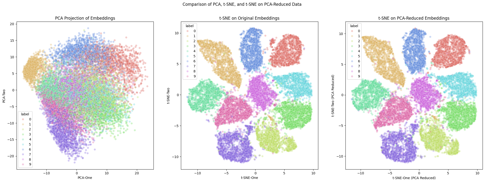

# MachLe PW 13 - Report

#### authors: Rafael Dousse, Massimo Stefani, Eva Ray

## 1. PCA

## 2. t-SNE

> Run the notebook and observe the resulting 2D visualization of the embeddings. Are the ten classes clearly separated? Provide that visualization.

It depends on the method used. When applying only PCA to reduce the dimensionality of the embeddings from 145 to 2, the resulting visualization shows some separation between the classes, but there is significant overlap and mixing of different classes. However, when applying t-SNE on both the original embeddings and the PCA-reduced embeddings, the classes are much more clearly separated, with a slightly better separation observed when t-SNE is applied after PCA.



> What is the dimensionality of the embedding data being fed to t-SNE? 

As show by the output of the embeddings creation step, the dimensionality is 145.

```bash
Embeddings shape: (70000, 145)
```

> What is the final dimensionality at the output of t-SNE?

As specified in the code to apply t-SNE, the final dimensionality is 2. This is indicated by the parameter `n_components=2` in the t-SNE instantiation:

```python
tsne = TSNE(n_components=2, ...)
```

It makes sense since the goal here is to visualize the data in a 2D space.

> Identify the values of the parameters used to obtain those results: perplexity, learning rate, momentum, and number of iterations.

The parameters used can be deduced from the t-SNE instantiation in the code:

```python
tsne = TSNE(n_components=2, verbose=1, perplexity=40, n_iter=300, random_state=42)
```

- **Perplexity**: 40
- **Learning rate**: not explicitly set, defaults to 'auto' in sklearn's implementation. The documentation says "The ‘auto’ option sets the learning_rate to max(N / early_exaggeration / 4, 50) where N is the sample size" (15000 in our case) and early_exaggeration defaults to 12.0. This gives approximately `max(15000 / 12 / 4, 50) = max(312.5, 50) = 312.5`
- **Momentum**: not used in sklearn's implementation
- **Number of iterations**: 300

These informations can be found in the documentation of sklearn's at [TSNE](https://scikit-learn.org/stable/modules/generated/sklearn.manifold.TSNE.html).

> What is the formula used to compute the error every 10 iterations?

TSNE uses the Kullback-Leibler divergence [1](https://en.wikipedia.org/wiki/T-distributed_stochastic_neighbor_embedding) to measure the difference between the high-dimensional and low-dimensional distributions. The error reported every 10 iterations is the KL divergence value, which quantifies how well the low-dimensional representation preserves the pairwise similarities of the high-dimensional data.

Here is the formula for KL divergence [2](https://en.wikipedia.org/wiki/Kullback%E2%80%93Leibler_divergence) used in t-SNE:


where
- P is the true probability distribution
- Q is the approximated probability distribution
- D_KL is the Kullback-Leibler divergence

> What happens if you feed the original embeddings directly to the t-SNE algorithm without any preprocessing?

If we feed the original embeddings directly to the t-SNE algorithm without any preprocessing (like PCA), the resulting 2D visualization still shows some separation between the classes, but is less distinct and more cluttered compared to when PCA is applied first. The clusters are not as well-defined, and there is more overlap between different classes, making it harder to distinguish them.


> Are you satisfied with the 2D visualization of the ten classes of embeddings? If not, modify the parameters to improve the visualization. Provide the resulting visualization and explain the adjustments you made to achieve it.

The visualization obtained with t-SNE on PCA-reduced data is quite satisfactory, as the ten classes are well-separated and clearly distinguishable. However, to separate the classes even more distinctly, we made the following adjustments to the t-SNE parameters:

- `perplexity=80`: Increased to 80 to have a better balance between local and global structure in the data.
- `n_iter=1000`: Increased to 1000 to allow more iterations for better convergence.
- `early_exaggeration=20`: Added to amplify the initial separation of clusters.

The resulting visualization shows even clearer separation between the classes, with minimal overlap.


> Check the computational time required to perform PCA followed by t-SNE or just t-SNE on the raw embeddings and compare the results.

On our machine, running t-SNE on PCA-reduced (dimension 50) data took approximately 12.03 seconds, while running t-SNE directly on the raw embeddings (dimension 145) took about 12.9 seconds. The difference in computational time is not very significant in this case, likely due to the relatively small size of the dataset (15,000 samples). However, for larger datasets, applying PCA before t-SNE can lead to more substantial reductions in computation time.

## 3. UMAP