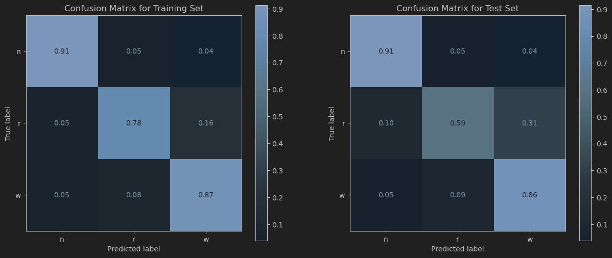

# MachLe PW 9 - Report

#### authors: Rafael Dousse, Massimo Stefani, Eva Ray

## 1. Classification Tree 

> Q1.1: At which frequencies does the electrical activity mostly occur?

> Q1.2: Can you easily distinguish between classes visually? What can you say about the inter- vs intra-class variability?

> Q1.3: Describe both of these criteria. What does a gini impurity of 0 means? What does an entropy of 1 mean?

> Q1.4: This problem suffers from a common issue in machine learning. What is this problem called? What could be its causes? How can it be resolved?

> Q1.5: Use the visualization of this tree to show and explain:
>    - What is a node? What is an edge? What is a leaf?
>    - What are the two additional hyperparameters doing? Do you think that both are necessary in this particular case (min_samples_leaf = 20, max_depth= 4)? Why?
>    - What does the color of each node represent?

> Q1.6: Choose one of the nodes. Explain precisely the information given on each line of text in this node.

> Q1.7: Does model 2 still have the same problem as model 1? Explain based on the classification reports and the confusion matrices.

> Q1.8: One of the class seems more difficult to predict than others? Which one? Where could this difficulty come from in your opinion?

> Q1.9: What does this hyperparameter do? Explain giving examples from this dataset.

> Q1.10: Compare results from model 2 and model 3. What are the pros and cons of each of them?

## 2. Random Forest

> Q2.1: For each of the hyperparameter: Is there a range of value giving particularly good results? Or particularly bad results?

- `max_depth`: We observe that when the value if too low (~1-3), the performance is worse, regardless of the other hyperparameters. This is probably because a not deep tree is too simple. For higher values, we see a lot of points at around 0.75-0.8 accuracy and not many differences between them. It seems that the model is not very sensitive to this hyperparameter as long as it is not too low.
- `n_estimators`: The accuracy does not vary a lot after ~50 trees. This suggests that adding more trees does not improve the performance significantly after a certain point, so a moderate number of trees may be sufficient for this task. Between 1 and 50 trees, we can see that the accuracy improves as the number of trees increases.
- `max_features`: All the values seem to give similar results. The lowest accuracy seems to be higher as the number of features increases, but this is not very clear.
- `min_samples_leaf`: This is the hyperparameter where we can see the most significant differences as the number of samples per leaf increases. The accuracy tends to increase as the number of samples per leaf increases and the accuracies are more compact at higher values.

> Q2.2: These representations give valuable information about hyperparameters. It is nevertheless insufficient. What are/is the main problem(s) with those graphs in your opinion? 

These graphs don't give a clear global view of how the hyperparameters interact with each other. They only show the relationship between one hyperparameter and the score at a time, while the model’s performance actually depends on the combination of all hyperparameters. Thus, it is difficult to identify the best combination of hyperparameters using these plots alone.

> Q2.3: What do the following plots represent?

The plots represent a pair-wise comparison of hyperparameters using the accuracy score as the metric. A point in the plot indicates the accuracy achieved for a specific combination of two hyperparameters. The color of the point indicates the accuracy score, where colors closer to yellow represent higher accuracy and colors closer to purple represent lower accuracy. This type of plot is called a heatmap.

> Q2.4: What do the white spots (=empty spots) in the heatmaps mean?

The white spots in the heatmaps indicate combinations of hyperparameters that were not tested during the hyperparameter tuning process. This means that for those specific pairs of hyperparameter values, there is no corresponding accuracy score available, probably because those combinations were not included in the grid search or random search used to explore the hyperparameter space.

> Q2.5: How do those plots address the limitations of the previous visualizations?

In these plots, we can clearly see how pairs of hyperparameters interact with each other and how they jointly affect the model's accuracy. This allows us to identify combinations of hyperparameters that lead to better performance, which was not possible with the previous plots that only showed the effect of individual hyperparameters in isolation. The heatmaps provide a more comprehensive view of the hyperparameter space and help in understanding the relationships between different hyperparameters.

> Q2.6: What is grid search? Explain by giving real examples from this specific task.

Grid search is a method for hyperparameter tuning that involves looping through a predefined set of hyperparameter values and evaluating the model's performance for each combination. In this specific task, where we train a random forest classifier, we will define a list of values to test for each hyperparameter, such as `max_depth`, `n_estimators`, `max_features`, and `min_samples_leaf`. 

Let's see an example:
- For `max_depth`, we might choose to test values [3, 5, 7, 9].
- For `n_estimators`, we might choose to test values [50, 100, 150].
- For `max_features`, we might choose to test values [10, 15, 20].
- For `min_samples_leaf`, we might choose to test values [15, 20, 25].
- The grid search will then train and evaluate the random forest model for each combination of these hyperparameter values (e.g., (3, 50, 10, 15), (3, 50, 10, 20), etc.) and record the accuracy for each combination. Finally, it will select the combination that has the highest accuracy as the best set of hyperparameters for the model.

> Q2.7: Use the plots above to narrow the range of hyperparameters you want to explore. Which values did you choose to test for each parameter? Justify your choices.

In the heatmaps, we locate the yellow areas that indicate higher accuracy. Based on these regions, we can select the min and max relevant values for each hyperparameter.
- `max_depth`: In each plot that includes `max_depth`, we can see that highest accuracies are reached when `max_depth` is between around 3 and 9. 
- `n_estimators`: The range for this hyperparameter is not really reduced by the heatmaps, as we can see high accuracies for all values, except very low values. Thus, we can have chosen to test values between 10 and 210 but it takes too much computational time so we reduced the range to between 100 and 200.
- `max_features`: In the heatmaps comparing `max_features` to ``n_estimators`` and `min_samples_leaf`, we can see that the highest accuracies are reached when `max_features` is between around 10 and 20.
- `min_samples_leaf`: In all the plots that include `min_samples_leaf`, we can see that highest accuracies are reached when `min_samples_leaf` is between around 15 and 25.

In each case, to save computational time, we do not test every single value in the identified ranges, but rather test all values with a certain step.

> Exercise 2.1: Once you know which values of hyperparameters you want to explore, complete the following code to perform a grid search on those values. Remember that the more values you choose to test, the longer the computational time required.

We used the following ranges for the hyperparameters:

```python
param_grid = {
    'n_estimators': list(range(100, 201, 25)),
    'max_features': list(range(10, 21, 2)),
    'max_depth': list(range(3, 10, 3)),
    'min_samples_leaf': list(range(15, 26, 3))
}
```

The output is:

```
Fitting 4 folds for each of 360 candidates, totalling 1440 fits
Best parameters: {'max_depth': 6, 'max_features': 10, 'min_samples_leaf': 21, 'n_estimators': 200}
```

> Exercise 2.2: Complete the code in order to choose one final value for each of the hyperparameters and train the model.

Based on the grid search results, we chose the following values for the hyperparameters:

```python
hyperparameters = {
     'max_features': 10,
     'n_estimators': 200,
     'max_depth': 6,
     'min_samples_leaf': 21
}
```

> Q2.8: Which value did you choose for each hyperparameter?

We chose the following values for the hyperparameters based on the grid search results:
- `max_depth`: 6. This makes sense because it is neither too shallow nor too deep, allowing the model to capture important patterns without overfitting.
- `n_estimators`: 200. A higher number of trees generally leads to better performance.
- `max_features`: 10. This value allows the model to consider a reasonable number of features at each split, promoting diversity among the trees.
- `min_samples_leaf`: 21. This value helps to prevent overfitting by ensuring that each leaf has a sufficient number of samples.

> Q2.9: The test set should be used only at this stage, and it is theoretically important not to change the hyperparameters based on the performance on the test set. Why?

The purpose of the test set is to provide an unbiased evaluation of a final model fit on the training dataset. In particular, it is used to assess how well the model generalizes to unseen data. If we were to change the hyperparameters based on the performance on the test set, we would be indirectly using the test set as part of the model training process. This could lead to overfitting to the test set, meaning that the model would perform well on the test data but might not generalize well to new, unseen data. Thus, we still wouldn't know the true performance of the model in real-world scenarios.

> Q2.10: Comment your results. -> How well does the model generalize on unseen data? Is a random forest better than a single classification tree in this case? What is the main challenge of this dataset?

Our final model gives the following classification report on the train and test sets:

```
Classification Report for Training Set:
              precision    recall  f1-score       support
n              0.900294  0.912209  0.906212   5365.000000
r              0.435685  0.782123  0.559627   1074.000000
w              0.956797  0.866182  0.909237   9767.000000
accuracy       0.875848  0.875848  0.875848      0.875848
macro avg      0.764259  0.853505  0.791692  16206.000000
weighted avg   0.903557  0.875848  0.885067  16206.000000
```

```
Classification Report for Test Set:
              precision    recall  f1-score      support
n              0.897290  0.914244  0.905688  1376.000000
r              0.359551  0.590406  0.446927   271.000000
w              0.937868  0.859875  0.897180  2405.000000
accuracy       0.860316  0.860316  0.860316     0.860316
macro avg      0.731570  0.788175  0.749932  4052.000000
weighted avg   0.885410  0.860316  0.869956  4052.000000
```

And the following confusion matrices for the train and test sets:



First of all, the accuracy on the test set is 86.03%, which is quite close to the 87.58% accuracy on the training set. This indicates that the model generalizes well to unseen data, as there is not a significant drop in performance from the training to the test set.

That said, we can see that the model does not perform equally well across all classes. The 'r' class has a notably lower precision (35.96%) and recall (59.04%) on the test set compared to the 'n' and 'w' classes. When taking a look at the confusion matrix of the test set, we can see that 10% of the 'r' class samples are misclassified as 'n' and 31% as 'w'. This suggests that the model struggles to distinguish the 'r' class from the other two classes, which could be due to the fact that the classes are imbalanced (5365 n, 1074 r, 9767 w in the training set). 

The model using Random Forest performs better than a single classification tree. This is due to the fact that Random Forests aggregate the predictions of multiple trees, which helps to reduce overfitting and improve generalization. In contrast, a single classification tree can easily overfit the training data, leading to poorer performance on unseen data.

The main challenge of this dataset appears to be the class imbalance, particularly with the 'r' class being underrepresented compared to the 'n' and 'w' classes. This imbalance can make it difficult for the model to learn to accurately classify the minority class, leading to lower precision and recall for that class.

> Q2.11: How is this importance calculated?

In the scikit-learn documentation, we can find "_Feature importances are provided by the fitted attribute ``feature_importances_`` and they are computed as the mean and standard deviation of accumulation of the impurity decrease within each tree._". Thus, the importance of a feature is calculated based on how much it decreases the impurity in the decision trees of the random forest. The more a feature contributes to reducing impurity across all trees, the higher its importance score will be. The mean decrease in impurity is also known as the Gini importance.

Here is the detailed process:
1. For each tree in the random forest, calculate the total decrease in impurity (e.g., Gini impurity or entropy) that results from splits on each feature.
2. Sum these impurity decreases for each feature across all trees in the forest.
3. Normalize the importance scores so that they sum to 1.
4. The resulting scores represent the relative importance of each feature in making predictions.

> Q2.12: What can you conclude from this graph?

There is a big difference in feature importance between the first features and the last ones. The first 15-20 features have significantly higher importance scores compared to the rest with features 1, 2, 3, 4, 7 with an importance above 0.08. The features above feature 20 have very low importance, close to 0 (with a small increase between 85 and 90). This suggests that only a subset of the features is really relevant for the classification task, while many features contribute very little to the model's predictions. This could indicate that some features are redundant or irrelevant, and removing them could potentially improve the model's performance and reduce potential overfitting.

## 3. Gradient Boosting for classification

> Q3.1: Two additional hyperparameters were added compared to the RandomForestClassifier. What are these hyperparameters, and what roles do they play?

The two additional hyperparameters are:

- learning_rate (0.05): Controls the contribution of each tree to the final prediction. A lower learning rate means each tree has less influence, requiring more trees but typically leading to better generalization and reduced overfitting. It shrinks the contribution of each tree by this factor.

- subsample (0.5): The fraction of samples to be used for fitting each individual tree. Setting it to 0.5 means only 50% of the training data is randomly sampled for each tree. This helps prevent overfitting as well.

> Q3.2: Comment the results. Compare these results with the ones obtained with the RandomForestClassifier. Compare more specifically the precision, the recall and the f1-score of the 'r' class obtained with GradientBoostingClassifier and RandomForestClassifier. What are your conclusions?

Our Gradient Boosting model performs noticeably better overall than the Random Forest. The test accuracy increases from 86.03% to 91.12%, showing that the model makes fewer mistakes on the whole dataset.

The most important difference appears on the “r” (REM sleep) class. Gradient Boosting strongly improves precision: 73.51% instead of 35.96%. This means that when the model predicts “r”, it is far more likely to be correct. The gain is large, roughly a 104% increase. However, this improvement comes with a drawback. The recall decreases from 59.04% to 40.96%, which means the model now misses more true “r” samples. In other words, it predicts “r” less often, but with much higher reliability.

The global F1-score for the “r” class increases from 44.69% to 52.61%, which indicates a more balanced performance despite the recall drop. The model becomes more selective but also more accurate in its positive predictions.

This behavior is explained by how Gradient Boosting trains its sequence of trees. Each new tree focuses specifically on the errors made by the previous ones. As a result, samples from class “r” that were misclassified receive more weight in later iterations. The model gradually learns to avoid the types of mistakes it repeatedly made before. This reduces false positives for “r”, which is why precision rises so sharply. At the same time, the model becomes more conservative and stops predicting “r” in uncertain cases, which explains the lower recall.


```
Accuracy on Training Set: 0.9564975934838948
Accuracy on Test Set: 0.9111549851924975
Classification Report for Training Set:
              precision    recall  f1-score       support
n              0.956192  0.964212  0.960186   5365.000000
r              0.953608  0.689013  0.800000   1074.000000
w              0.956886  0.981673  0.969121   9767.000000
accuracy       0.956498  0.956498  0.956498      0.956498
macro avg      0.955562  0.878300  0.909769  16206.000000
weighted avg   0.956439  0.956498  0.954955  16206.000000
```

```
Classification Report for Test Set:
              precision    recall  f1-score      support
n              0.916968  0.922965  0.919957  1376.000000
r              0.735099  0.409594  0.526066   271.000000
w              0.918521  0.960915  0.939240  2405.000000
accuracy       0.911155  0.911155  0.911155     0.911155
macro avg      0.856863  0.764491  0.795088  4052.000000
weighted avg   0.905726  0.911155  0.905058  4052.000000
```


The explanation of how Gradient Boosting focuses on correction errors is further illustrated in the following example.

1. Training the Gradient Boosting Trees: the First Tree
    
    First, we train a decision tree (f1) using all the data and features.  
    Then, we calculate its predictions f1(x) and compare them to the ground truth y:

    $$
    \begin{array}{c|c|c|c}
    x & y & f_1(x) & y - f_1(x) \\
    \hline
    x_1 & 10 & 9  & 1  \\
    x_2 & 11 & 13 & -2 \\
    x_3 & 13 & 15 & -2 \\
    x_4 & 20 & 25 & -5 \\
    x_5 & 22 & 31 & -9 \\
    \end{array}
    $$

2. The Second Tree

As we see, the first tree seems off. How can we improve it? An intuitive strategy is to fit another regressor f2 on the residuals y − f1. If it's accurate, then f1(x) + f2(x) ≈ y, and the model becomes more precise.

To evaluate the adequacy of f1 + f2, we compute the new residuals y − f1(x) − f2(x):

$$
\begin{array}{c|c|c|c|c}
x & y & f_1(x) & f_2(x) & y - f_1(x) - f_2(x) \\
\hline
x_1 & 10 & 9  & 0.5 & 0.5 \\
x_2 & 11 & 13 & 1   & -3  \\
x_3 & 13 & 15 & -1  & -1  \\
x_4 & 20 & 25 & -2  & -3  \\
x_5 & 22 & 31 & -4  & -5  \\
\end{array}
$$


If the residuals are sufficiently small, we stop here and use f1 + f2 as our model.  
If not, we fit another tree f3 to predict the remaining residuals and continue. We repeat the process until the residuals are reduced to an acceptable level or until the maximum number of trees is reached.

On the other hand, if the data is noisy, Gradient Boosting can overfit more easily than Random Forest due to its focus on minimizing errors from previous trees.

Note: This example has been taken as is from the following source:

[baeldung](https://www.baeldung.com/cs/gradient-boosting-trees-vs-random-forests)

And explained in more detail in the following source:

[geeksforgeeks](https://www.geeksforgeeks.org/machine-learning/gradient-boosting-vs-random-forest/#robustness-to-noise-of-gradient-boosting-vs-random-forest)
